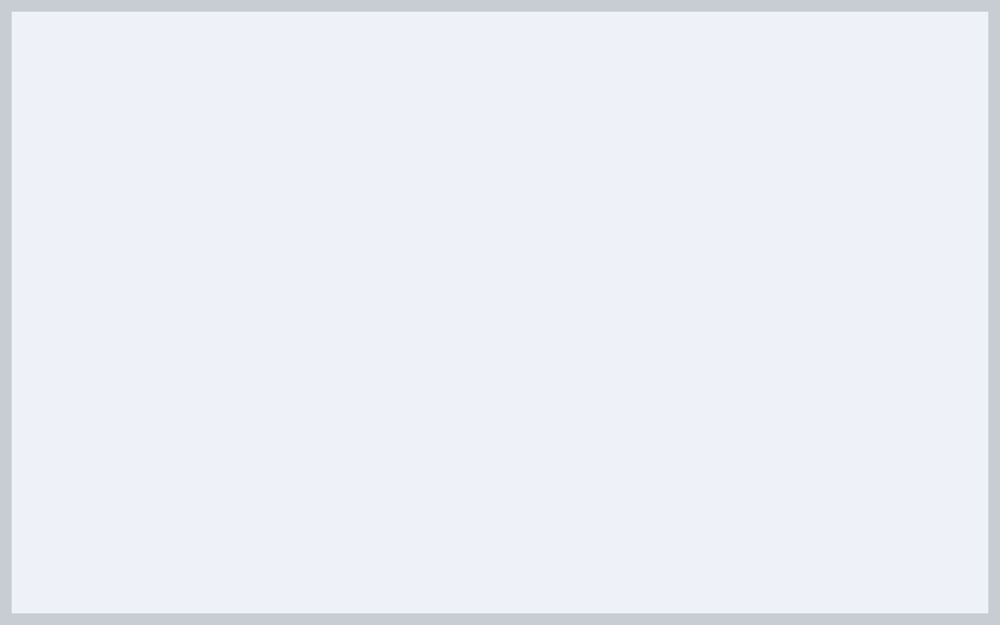

# MD 阅读器 · MD Reader

> 一个基于 Tauri 2 + React 19 的 Windows 桌面 Markdown 阅读器。
> A clean, fast desktop Markdown reader for Windows, built with Tauri 2 + React 19.

[](https://github.com/ginger1688/md-reader/releases)
[](LICENSE)

---

## 简介 · Overview

**中文** — MD 阅读器是一款轻量、专注的本地 Markdown 阅读工具。基于 Tauri 2 构建，不打包浏览器内核，安装包仅约 2.5 MB，启动迅速、资源占用低。支持代码块复制、表格复制、文档大纲、页内查找、阅读宽度调节等实用功能，并针对超大文档与中文（GBK）编码做了专门优化。

**English** — MD Reader is a lightweight, focused local Markdown reading app. Built on Tauri 2, it ships without a bundled browser engine — the installer is only ~2.5 MB, with fast startup and low resource usage. It offers code/table copy buttons, document outline, in-page search, adjustable reading width, and is tuned for very large documents and Chinese (GBK) encodings.

## 功能特性 · Features

- 代码块 / 表格一键复制
- 文档大纲与点击跳转
- 页内查找（高亮 + 上下翻页）
- 阅读宽度可调（60%–100%）
- SVG / 大图正常显示
- 大文档滚动稳定，无抖动
- 中英文双语文档就绪

## 截图 · Screenshots

> 以下为占位图，待替换为实际应用界面截图（建议 ≥1280×800）。
> Placeholders — replace with real app captures (≥1280×800 recommended).




## 下载 · Download

前往 [Releases](https://github.com/ginger1688/md-reader/releases) 页面，下载最新版的安装包（如 `md-reader-0.2.12-setup.exe`），双击安装即可。

Go to the [Releases](https://github.com/ginger1688/md-reader/releases) page and download the latest installer (e.g. `md-reader-0.2.12-setup.exe`), then run it.

> 未签名程序，Windows SmartScreen 可能提示「Windows 已保护你的电脑」，点「仍要运行」即可。
> Unsigned build: Windows SmartScreen may warn you — click “Run anyway” / “仍要运行”.

## 快速开始 · Quick Start

1. 下载安装包并安装。
   Download and install the package.
2. 启动 MD 阅读器，点顶部工具栏的「打开文件」按钮选择 `.md` 文件。
   Launch MD Reader, click “打开文件” (Open File) in the toolbar to open a `.md` file.
3. （可选）双击 `.md` 直接打开：若系统已关联其他程序，需右键 → 打开方式 → 勾选「始终」。
   (Optional) To open `.md` by double-click, set the default app if another program is already associated.

## 技术栈 · Tech Stack

- [Tauri 2](https://tauri.app/) — 桌面应用框架
- [React 19](https://react.dev/) — 前端 UI
- [Vite 7](https://vitejs.dev/) + [TypeScript 5.8](https://www.typescriptlang.org/)
- [markdown-it](https://github.com/markdown-it/markdown-it) — Markdown 解析
- [DOMPurify](https://github.com/cure53/DOMPurify) — 安全清洗

## 从源码构建 · Build from Source

```bash
git clone https://github.com/ginger1688/md-reader.git
cd md-reader
npm install
npm run tauri build
```

产物位于 `md-reader/src-tauri/target/release/bundle/nsis/`。

The output is in `md-reader/src-tauri/target/release/bundle/nsis/`.

## 许可证 · License

[MIT](LICENSE) © 2026 MD 阅读器 (MD Reader)
